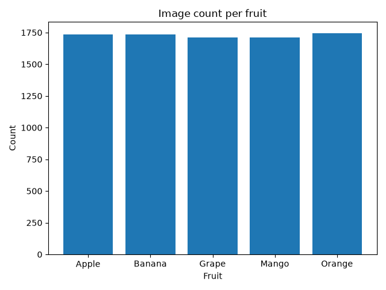
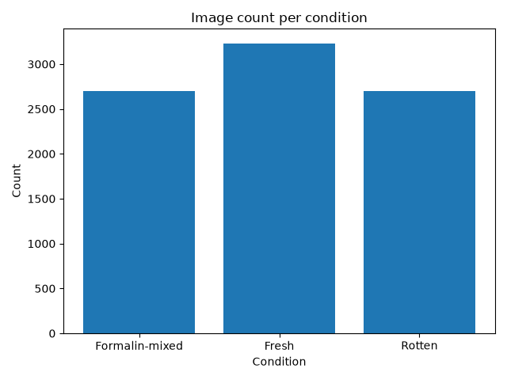
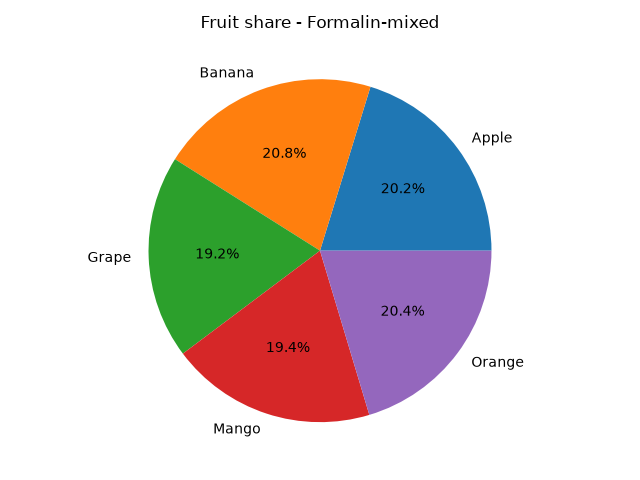
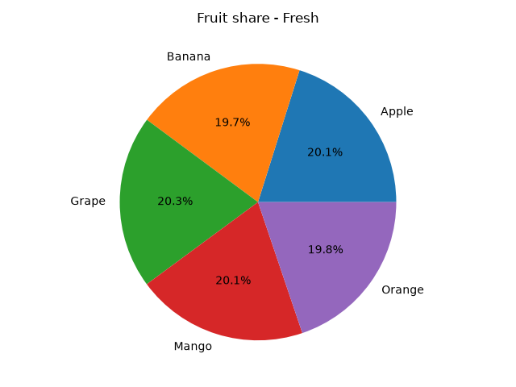
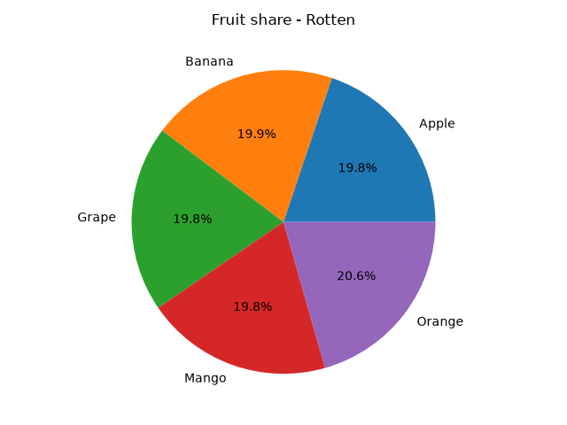

# Class Distribution

Total images: 8635

## Images per split

- train: 5858
- valid: 1528
- test: 1249

## Images per fruit

- Orange: 1746
- Banana: 1736
- Apple: 1734
- Grape: 1710
- Mango: 1709

## Images per condition

- Fresh: 3232
- Formalin-mixed: 2702
- Rotten: 2701

## Images per fruit x condition

| Fruit | Condition | Count |
|---|---|---|
| Apple | Formalin-mixed | 547 |
| Apple | Fresh | 651 |
| Apple | Rotten | 536 |
| Banana | Formalin-mixed | 562 |
| Banana | Fresh | 637 |
| Banana | Rotten | 537 |
| Grape | Formalin-mixed | 519 |
| Grape | Fresh | 655 |
| Grape | Rotten | 536 |
| Mango | Formalin-mixed | 524 |
| Mango | Fresh | 649 |
| Mango | Rotten | 536 |
| Orange | Formalin-mixed | 550 |
| Orange | Fresh | 640 |
| Orange | Rotten | 556 |

## Figures

### Image count per fruit

### Image count per condition

### Fruit share - Formalin-mixed

### Fruit share - Fresh

### Fruit share - Rotten

