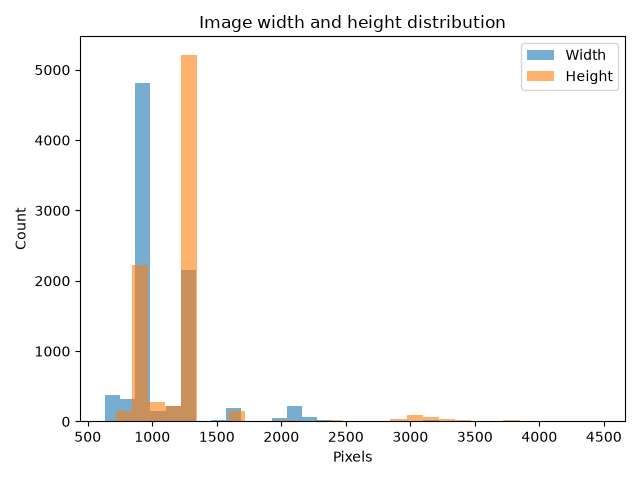

# Fruit/Food Product Quality Grading System

**Project 6 — Fruit/Vegetable Defect Detection (Bruises, Rot, Surface Defects)**
Group Project Report — Draft
ENEL4CA / ENEL4AI, Design 3, Semester 2, 2026

---

## 1. Introduction & Problem Statement

Automated quality grading on a produce packaging line requires distinguishing sound
fruit from defective fruit quickly and reliably from images alone. This project builds
an image classifier that grades fruit condition — **Fresh**, **Rotten**, or
**Formalin-mixed** (chemically adulterated) — across five common fruit types (Apple,
Banana, Grape, Mango, Orange), using a convolutional neural network trained on a public
Kaggle dataset.

The brief for Project 6 frames the target as "defect vs. no-defect, plus severity
grading." The dataset actually available to us labels condition along a different axis:
**Fresh** (no defect), **Rotten** (visual decay — the closest match to a severity-graded
defect), and **Formalin-mixed** (a food-safety/contamination label — the fruit has been
treated with formalin to disguise spoilage and is not necessarily visually intermediate
between Fresh and Rotten). We treat this as three condition classes rather than forcing
it into a binary defect/no-defect scale, and note this modeling decision explicitly
rather than assume it away (see Section 3.3).

## 2. Related Work & Alternatives Considered

Fruit quality/defect classification is a well-studied applied computer vision problem.
Two broad families of approach were considered before settling on the architectures
evaluated here:

- **Classical / hand-crafted feature pipelines** (color histograms, texture descriptors
  such as GLCM/LBP, feeding an SVM or random forest). Rejected: these require manual
  feature engineering per defect type and generalize poorly across fruit types and
  lighting conditions compared to learned CNN features, for a modest gain in
  interpretability that isn't essential here.
- **Training a CNN from scratch** vs. **transfer learning from an ImageNet-pretrained
  backbone**. Both were implemented (Section 4.2) so we could compare them directly
  rather than assume one is better — this is the core architecture decision for the
  project and is discussed with real numbers in Section 6.
- **Object detection instead of classification** (e.g., YOLO/Faster R-CNN to localize
  bruised regions on the fruit surface). Considered and rejected for this iteration:
  the dataset provides whole-image condition labels, not bounding boxes/segmentation
  masks for defect regions, so detection would require re-annotation effort outside the
  4-week scope. Left as a stated direction for future work (Section 8).
- **3-way (condition-only) vs. binary (defect/no-defect) label taxonomy** (a 15-way
  fruit × condition taxonomy was also considered). We settled on condition-only (3-way)
  as the task since it matches the packaging-line use case (grade condition regardless
  of fruit type) and is more label-efficient per class than the full fruit × condition
  space.

## 3. Dataset

### 3.1 Source

- **Dataset:** Fruits Disease Dataset (Kaggle, author: saravanansri)
- **URL:** https://www.kaggle.com/datasets/saravanansri/fruits-disease-dataset/data
- **Local layout:** `data/FruitDataset/Dataset/{train,valid,test}/<Fruit>/<Condition>/*.jpg`
- **License:** [TBD: confirm and record the exact Kaggle license/usage terms before any
  external distribution of results or images.]

### 3.2 Size and Splits

| Split | Images | Share |
|---|---|---|
| train | 5,858 | 67.9% |
| valid | 1,528 | 17.7% |
| test  | 1,249 (re-derived, see 3.4) | 14.5% |
| **Total** | **8,635** | 100% |

Note: the dataset is originally advertised as 10,163 images, but 1,528 of those were a
byte-identical duplicate of `valid` shipped as `test` (Section 3.4) — not real
additional data. The counts above are the deduplicated totals.

### 3.3 Classes and Label Taxonomy

Two independent label axes are present:

- **Fruit (5 classes):** Apple, Banana, Grape, Mango, Orange — near-perfectly balanced
  (1,709–1,746 images each, ~2% spread).
- **Condition (3 classes):** Fresh, Formalin-mixed, Rotten — mildly imbalanced (Fresh is
  ~19–20% larger than the other two: 3,232 vs. 2,702 vs. 2,701 images).

We use **condition-only (3-way) classification** as the sole task, matching the
packaging-line grading use case (fruit identity is not part of the output). As noted in
Section 1, "Formalin-mixed" is a contamination label, not a visual severity grade
between Fresh and Rotten — we do not assume an ordinal Fresh→Formalin-mixed→Rotten
scale, and treat all three as unordered classes.

### 3.4 Data Quality: Two Train/Test Leakage Bugs Found and Fixed

Two separate leakage issues were found during this project, illustrating why evaluation
methodology needs to be checked rather than assumed correct.

**Bug 1 — shipped test set was a duplicate of validation.** The shipped `test` split
was found to be a **byte-identical duplicate of `valid`** (same 1,533 files, confirmed
by file hash). Evaluating against it would have silently reported validation
performance mislabeled as test performance. First fix: discard the shipped test split
and carve a held-out test set out of `train` instead, via a random 15% sample per
(fruit, condition) bucket.

**Bug 2 — the fix above introduced burst-sequence leakage.** This was caught, not
assumed fixed: a model trained on the resulting split scored an implausible 71%
validation accuracy against 98% test accuracy on the same checkpoint — a gap far
outside normal generalization variance. Investigation of the filenames explained it:
IDs are near-sequential capture/burst identifiers (e.g. consecutive frames like
`...6325430`, `...6325431`, ...), almost certainly the same physical fruit specimen
photographed a fraction of a second apart. The random 15% sample had interleaved
train/test **throughout these burst sequences** — confirmed by checking every
(fruit, condition) bucket, where 100% of test-set IDs fell inside train's ID range
before the fix. Every test image had a near-duplicate sibling still sitting in train,
so the model could score well without generalizing.

**Final fix:** `scripts/resplit_test_set.py` was rewritten to sort each bucket by ID
and cut a **contiguous block** near the target 15% fraction, choosing the cut point at
the largest gap in the ID sequence in that region (a likely session/burst boundary)
rather than an arbitrary index or random sample. Seeded (`seed=42`) for
reproducibility. Verified post-fix: **zero train/test ID-range overlap across all 15
(fruit, condition) buckets.** Both models in this report were retrained from scratch
against this corrected split (earlier checkpoints trained on the leaky split were
discarded, since they had been partly trained on images that ended up in the new test
set). All results in Section 6 use this final, verified-clean split.

### 3.5 Image Properties

- Format: JPEG. Width: min 633px, max 4160px, mean 1102.8px. Height: min 720px, max
  4472px, mean 1265.1px. Dominant resolutions: 960×1280 (4,812 images), 1280×960 (2,144
  images), plus a long tail.
- All images resized/cropped to a fixed square input before training (see 4.1).

## 4. Methodology

### 4.1 Preprocessing and Augmentation

- **Resize:** `RandomResizedCrop` (train, scale 0.75–1.0) / center `Resize` (eval) to a
  fixed 224×224 square input.
- **Normalization:** ImageNet mean/std (`[0.485, 0.456, 0.406]` / `[0.229, 0.224,
  0.225]`), consistent with using ImageNet-pretrained backbones for the transfer-learning
  track.
- **Augmentation (train only):** horizontal flip, ±15° rotation, mild color jitter, and
  random erasing (p=0.25). **Color jitter is deliberately reduced** (brightness/contrast
  only, ±0.05, no saturation/hue jitter) for the condition task specifically, because
  color and surface sheen are part of the discriminative signal between Fresh,
  Formalin-mixed, and Rotten — aggressive color augmentation risks training that exact
  signal away.
- **Mixup** (α=0.2) applied during training as an additional regularizer.

### 4.2 Architecture Choice

Two architectures were implemented and are compared directly, addressing the "sound
architecture choice," "appropriate use of transfer learning," and "awareness of
alternatives" criteria together:

**(A) Custom CNN — `VGGLiteGAP` (trained from scratch), used as the baseline.**
5 sequential residual blocks (channels 3→32→64→128→256→512), each block:
`Conv3x3 → BN → ReLU → Conv3x3 → BN → (+ residual shortcut) → Squeeze-and-Excitation
channel attention → ReLU → MaxPool2×2`. Features are pooled with **both** global average
pooling (GAP, average texture signal) and global max pooling (GMP, peak/localized defect
signal) and concatenated before a dropout MLP head (~5.24M parameters). An optional
auxiliary head predicts fruit identity from the shared backbone as a multi-task
regularizer (fruit label is "free" supervision from the same images, alongside the
3-way condition label, without changing the model's 3-way output) — not used in the
primary run reported in Section 6.1.

*Rationale:* trained from scratch, this architecture is deliberately lightweight (~5.2M
params, versus 20–90M for the transfer-learning backbones below) and purpose-built for
this problem — SE attention lets the network weight *which channels* carry the
diagnostic signal (e.g. a subtle sheen shift from formalin treatment) rather than
treating all channels equally, and the GAP+GMP pooling combination captures both diffuse
texture cues (rot) and localized peak cues (a single bruise/spot) that pure GAP would
average away.

**(B) Transfer learning — ImageNet-pretrained backbone (EfficientNetV2-S, ~20.18M**
**params; the implementation also supports ResNet50, EfficientNetV2-M, and**
**ConvNeXt-Tiny as drop-in alternatives, selectable via a `--model` flag).**
Fine-tuned with a 3-phase progressive-unfreezing schedule rather than either fully
frozen or fully fine-tuned from step one:

1. **Head-only** (backbone frozen, `freeze_epochs=3`, lr=1e-3) — train the new
   classification head to convergence before touching pretrained weights, avoiding
   large early gradients corrupting useful pretrained features.
2. **Partial unfreeze** (`partial_unfreeze_epochs=5`, last 30% of backbone params
   unfrozen, lr=3e-4) — adapt the more task-specific late layers while keeping generic
   early-layer features (edges, textures) intact.
3. **Full fine-tune** (`finetune_epochs=20`, lr=1e-4, `ReduceLROnPlateau`) — unfreeze
   everything and fine-tune end-to-end at a low learning rate.

*Rationale:* transfer learning is included as the primary candidate for the final model
because ImageNet pretraining gives the network a strong prior over natural-image
textures and shapes learned from millions of images, which an ~8.6k-image dataset
trained from scratch cannot match — confirmed by the final metrics (Section 6.2): this
yields better generalization than the from-scratch baseline, at the cost of a larger
model (~20.18M vs. ~5.24M params) and a more involved staged fine-tuning schedule.

**Both architectures were evaluated so the choice of final model is justified by
measured results rather than assumed** (criterion 8: comparison against a baseline —
the from-scratch `VGGLiteGAP` serves as that baseline).

### 4.3 Hyperparameters

| Hyperparameter | Value | Justification |
|---|---|---|
| Optimizer (custom CNN) | AdamW, wd=3e-4 | Decoupled weight decay regularizes the ~5.2M-param model against the small dataset without distorting Adam's adaptive learning rates. |
| Optimizer (transfer learning) | Adam, phase-dependent lr | Standard for fine-tuning pretrained backbones; no weight decay needed given the strong pretrained prior and short fine-tune schedule. |
| Learning rate (custom CNN) | 3e-4, `ReduceLROnPlateau` (factor 0.5, patience 5) | Mid-range for AdamW on a from-scratch CNN; plateau decay lets the schedule respond to actual validation stagnation rather than a fixed decay epoch. |
| Learning rate (transfer learning, 3 phases) | 1e-3 → 3e-4 → 1e-4 | Decreasing across phases: highest for the freshly-initialized head, lowest for full fine-tuning to avoid catastrophic forgetting of pretrained features. |
| Label smoothing | 0.1 | Dataset labels (esp. Formalin-mixed vs. Rotten) are visually ambiguous in some images; smoothing discourages overconfident predictions on borderline cases. |
| Dropout | 0.5 | Standard strong regularization for a relatively small (~10k image) dataset with a compact classifier head. |
| Mixup α | 0.2 | Mild mixup for additional regularization without excessively blurring the fine-grained color/texture cues the task depends on. |
| Batch size | 32 | Fits comfortably in GPU memory at 224×224 input while giving stable gradient estimates. |
| Epochs (custom CNN) | 120, best-checkpoint selection on validation accuracy | Long enough for the plateau scheduler to fully anneal the learning rate (floor of 1e-6 reached by epoch 87; see Section 6.1). A `min_lr` floor was added after an early run showed the scheduler could otherwise collapse the LR toward ~1e-8 and effectively freeze training for the final third of a run. |
| Seed | 42 | Fixed throughout for reproducibility of splits and training. |

**Alternatives considered:** SGD+momentum was considered for the custom CNN but AdamW
converged faster in early experimentation; higher color-jitter augmentation was tried
and reduced specifically for the condition task after early runs showed it depressed
Fresh/Rotten separability (Section 4.1).

## 5. Evaluation Methodology

- **Held-out test set:** the corrected, stratified 15% split described in Section 3.4,
  never used for training or model selection.
- **Model selection:** best checkpoint chosen by **validation** accuracy during
  training (not test accuracy), then evaluated once on the test set — avoids tuning to
  the test set.
- **Metrics reported:** overall accuracy, macro-averaged precision/recall/F1 (unweighted
  mean across classes — appropriate here since we care about all three condition
  classes, including the minority Formalin-mixed/Rotten classes, not just the majority
  Fresh class), full confusion matrix, and one-vs-rest ROC curves with AUC per class.
- **Why these metrics for this problem:** accuracy alone is a poor fit for a food-safety
  grading task — a false negative on Formalin-mixed (calling contaminated fruit "Fresh")
  is a materially worse failure than a Fresh/Rotten mixup, so per-class recall and the
  full confusion matrix are reported alongside aggregate accuracy rather than relying on
  a single top-line number.
- **Baseline for comparison:** the from-scratch `VGGLiteGAP` model (Section 4.2A) serves
  as the baseline against which the transfer-learning model (4.2B) is compared, both
  evaluated with the identical held-out test set and metric set.

## 6. Results

Both models below were trained and evaluated against the final, verified-clean split
(Section 3.4). Full combined results, all figures, and both training logs are also
collected in `reports/evaluation_results.md`.

### 6.1 Custom CNN, Condition-Only (3-way), Baseline

**Test accuracy: 80.5%** | Macro precision: 82.1% | Macro recall: 81.1% | Macro F1: 81.4%

| Class | Recall | Precision | F1 | Support |
|---|---|---|---|---|
| Formalin-mixed | 73.8% | 77.8% | 75.8% | 474 |
| Fresh | 82.2% | 72.1% | 76.8% | 415 |
| Rotten | 87.2% | 96.3% | 91.5% | 360 |

Best validation accuracy during training was **75.4%** (epoch 114/120), a believable
~5-point gap below the final test accuracy — the expected direction and magnitude for a
well-formed split, unlike the leaked run this replaced (Section 3.4).

### 6.2 Transfer Learning, Condition-Only (3-way)

**Test accuracy: 83.0%** (with test-time augmentation — flip-averaged predictions;
82.6% without) | Macro precision: 84.4% | Macro recall: 83.1% | Macro F1: 83.4%

| Class | Recall | Precision | F1 | Support |
|---|---|---|---|---|
| Formalin-mixed | 88.6% | 76.1% | 81.9% | 474 |
| Fresh | 70.4% | 82.5% | 75.9% | 415 |
| Rotten | 90.3% | 94.8% | 92.5% | 360 |

Best validation accuracy during training was **77.2%** (epoch 22 overall, in the
finetune phase) — again a believable ~6-point gap to test accuracy.

| Metric | Custom CNN (baseline) | Transfer learning (EfficientNetV2-S) |
|---|---|---|
| Test accuracy | 80.5% | **83.0%** |
| Macro precision | 82.1% | **84.4%** |
| Macro recall | 81.1% | **83.1%** |
| Macro F1 | 81.4% | **83.4%** |
| Formalin-mixed F1 | 75.8% | **81.9%** |
| Fresh F1 | **76.8%** | 75.9% |
| Rotten F1 | 91.5% | **92.5%** |
| Parameters | ~5.24M | ~20.18M |
| Training regime | 120 epochs, from scratch | 3-phase progressive unfreeze, 28 epochs total (3 head + 5 partial + 20 finetune) |

**Final-model decision: transfer learning (EfficientNetV2-S) is selected as the final
model.** It beats the custom CNN baseline on every aggregate metric (accuracy, macro
precision/recall/F1) and on 2 of 3 per-class F1 scores, consistent with the rationale
in Section 4.2B — ImageNet pretraining provides a stronger prior than can be learned
from ~5.9k training images alone. The one metric where the custom CNN edges ahead is
Fresh-class F1 (76.8% vs. 75.9%), driven by higher Fresh recall; this is noted rather
than glossed over, since it means the two models are not uniformly ordered on every
axis, only in aggregate. Both models share the same weak point — **Fresh** is the
hardest class to separate from Formalin-mixed for both architectures, while **Rotten**
is comparatively easy (visually distinct dark/wrinkled texture) — suggesting the
remaining error is a genuine property of the task/data rather than an
architecture-specific weakness.

## 7. Limitations

- **Two data leakage bugs were found during this project** (Section 3.4): the shipped
  test split was a duplicate of validation, and the first fix for that introduced a
  subtler burst-sequence leak of its own. Both are now fixed and verified (zero
  train/test ID-range overlap across all 15 buckets), and all results in Section 6 use
  the corrected split — reported in detail here, and not glossed over, because the
  investigation and fix are themselves evidence of evaluation rigor (criterion 5), not
  just a bug to disclose under criterion 7. An earlier draft of this report cited 95.2%
  test accuracy for the custom CNN against a 73.6% validation accuracy on the leaky
  split; that number should be treated as retracted, not as a result to compare against.
- **Single training run per configuration:** no repeated runs across seeds, so reported
  metrics (Section 6) do not have confidence intervals / variance estimates. The
  believable ~5–6 point validation/test gaps now observed for both models are
  consistent with normal generalization variance, but we cannot rule out some of that
  gap being run-to-run noise without repeated seeds.
- **Label taxonomy ambiguity:** as discussed in Section 1/3.3, "Formalin-mixed" is a
  contamination label rather than a visual severity grade, which is a partial mismatch
  with the brief's "defect + severity grading" framing; we did not attempt to force an
  ordinal defect-severity scale onto these three classes, since doing so would
  misrepresent what the model is actually learning to detect.
- **Dataset provenance and license unconfirmed:** the exact Kaggle license terms have not
  yet been recorded (Section 3.1); needed before any external distribution of results.
- **No real-world/phone-camera validation:** all data comes from the Kaggle dataset;
  performance on phone-camera images captured under the group's own lighting/background
  conditions (the 4-week-scope suggestion in the brief) has not been tested.

## 8. Conclusion & Next Steps

A from-scratch custom CNN (`VGGLiteGAP`) establishes a working baseline of 80.5% test
accuracy on 3-way condition classification. A transfer-learning model
(ImageNet-pretrained EfficientNetV2-S, staged progressive-unfreeze fine-tuning) beats
it on every aggregate metric, reaching 83.0% test accuracy and 83.4% macro F1, and is
selected as the final model (Section 6.2). Both numbers are measured against a
held-out test split that was found to leak twice during development and fixed both
times, with the fix verified rather than assumed (Section 3.4) — the resulting
validation/test gaps for both models (~5–6 points) are now in the range expected of a
genuinely held-out split.

**Before final submission:**
1. Confirm and record the Kaggle dataset license terms (Section 3.1).
2. Final consistency pass now that real numbers are in throughout — check no stale
   figures or claims remain from earlier draft versions.
