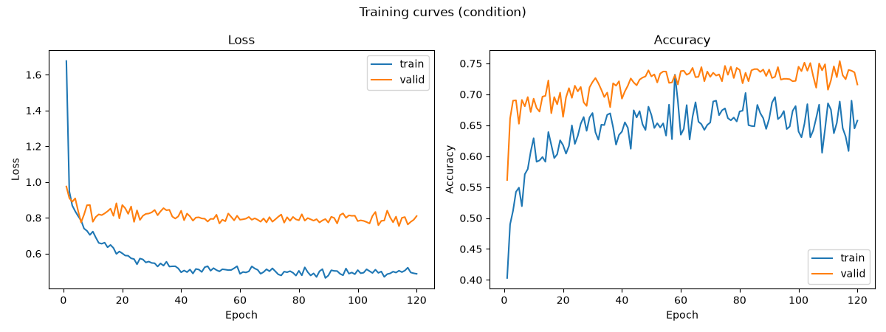
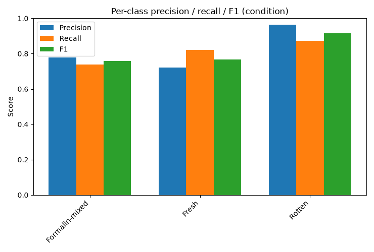
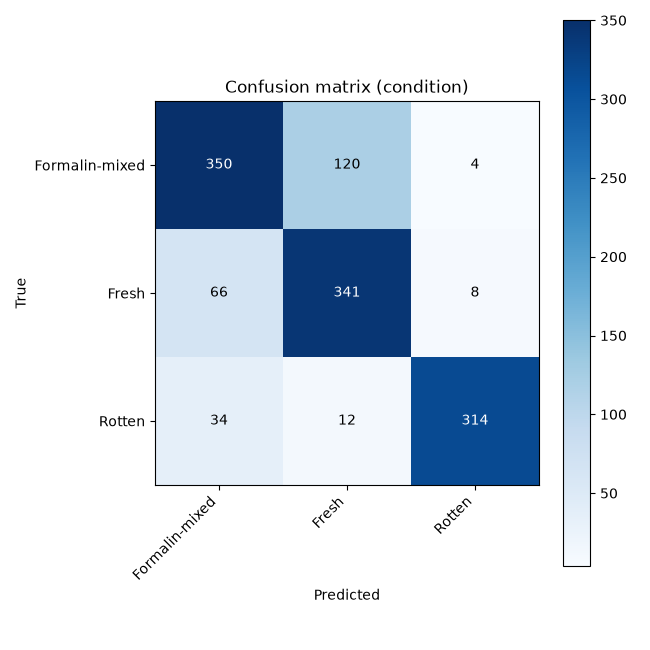
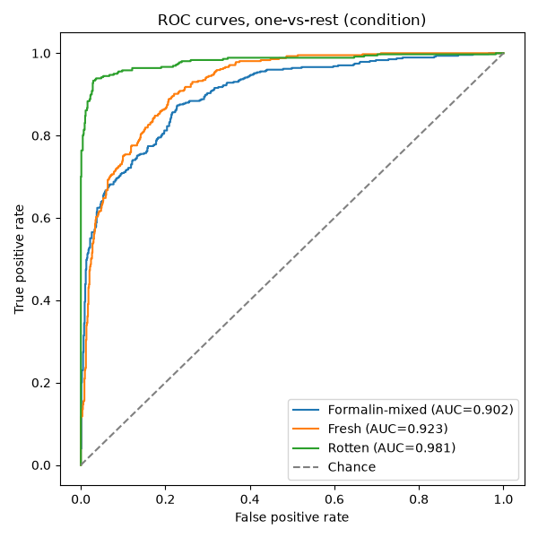
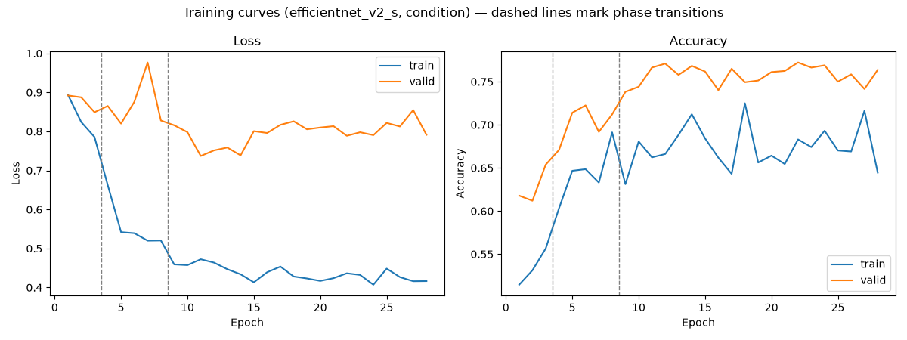
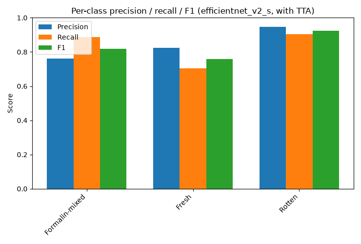
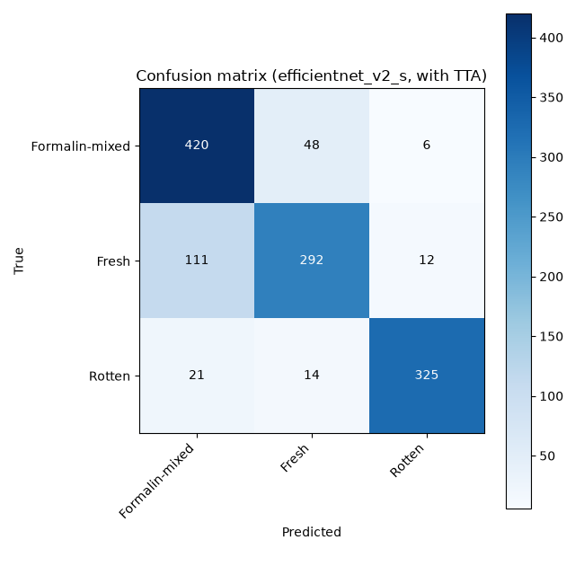
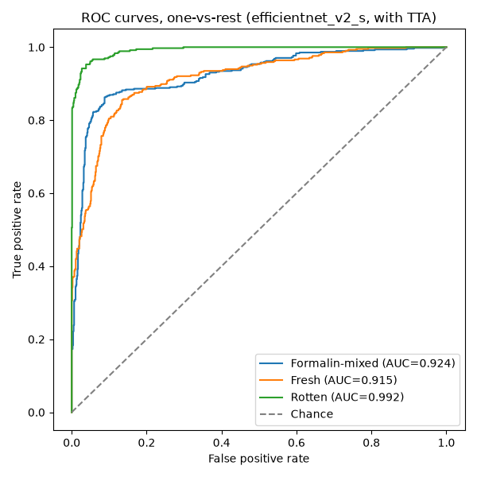

# Evaluation Results

Both models evaluated on the same corrected, leakage-free held-out test set (`data/FruitDataset/Dataset/test`, re-split by `scripts/resplit_test_set.py`). Model selection was by best validation accuracy during training; test set was touched only once, at the end.

## Comparison

| Metric | Custom CNN (VGGLiteGAP) | Transfer learning (EfficientNetV2-S, TTA) |
|---|---|---|
| Test accuracy | 80.5% | 83.0% |
| Macro precision | 82.1% | 84.4% |
| Macro recall | 81.1% | 83.1% |
| Macro F1 | 81.4% | 83.4% |
| Formalin-mixed F1 | 75.8% | 81.9% |
| Fresh F1 | 76.8% | 75.9% |
| Rotten F1 | 91.5% | 92.5% |
| Best valid accuracy | 75.4% (epoch 114/120) | 77.2% (epoch 22, finetune phase) |
| Parameters | ~5.24M | ~20.18M |

Transfer learning wins on accuracy/macro F1, as expected from a pretrained backbone. Both models share the same weak point: **Fresh** is the hardest class to separate from Formalin-mixed, while **Rotten** is easy for both (visually distinct dark/wrinkled texture).

## Custom CNN (VGGLiteGAP)

Checkpoint: `outputs/checkpoints_custom/custom_condition_best.pt`

**Test accuracy: 80.5%** | Macro precision: 82.1% | Macro recall: 81.1% | Macro F1: 81.4%

| Class | Recall | Precision | F1 | Support |
|---|---|---|---|---|
| Formalin-mixed | 73.8% | 77.8% | 75.8% | 474 |
| Fresh | 82.2% | 72.1% | 76.8% | 415 |
| Rotten | 87.2% | 96.3% | 91.5% | 360 |

## Transfer learning (EfficientNetV2-S)

Checkpoint: `outputs/checkpoints/efficientnet_v2_s_condition_best.pt` | Test-time augmentation: with TTA

**Test accuracy: 83.0%** | Macro precision: 84.4% | Macro recall: 83.1% | Macro F1: 83.4%

| Class | Recall | Precision | F1 | Support |
|---|---|---|---|---|
| Formalin-mixed | 88.6% | 76.1% | 81.9% | 474 |
| Fresh | 70.4% | 82.5% | 75.9% | 415 |
| Rotten | 90.3% | 94.8% | 92.5% | 360 |

